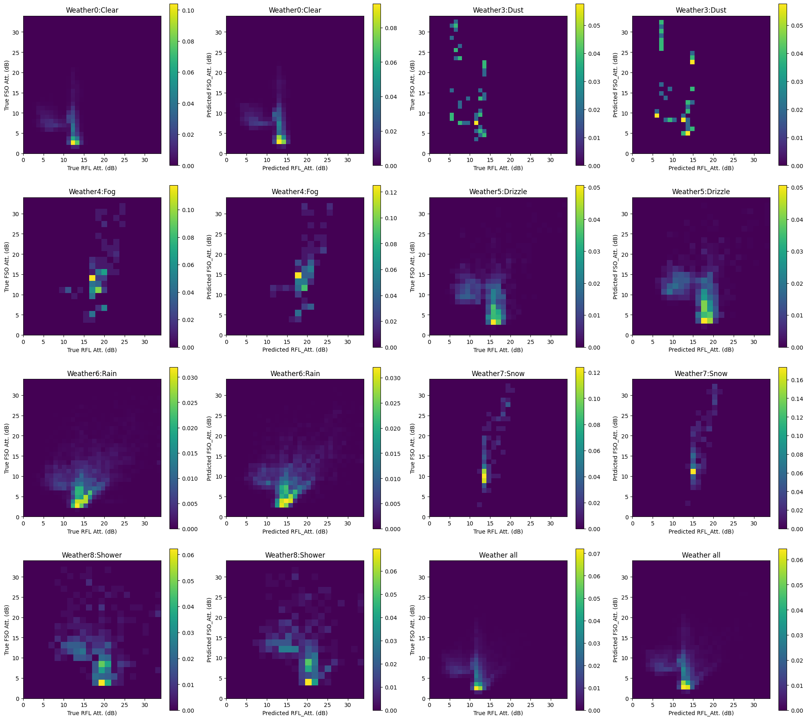
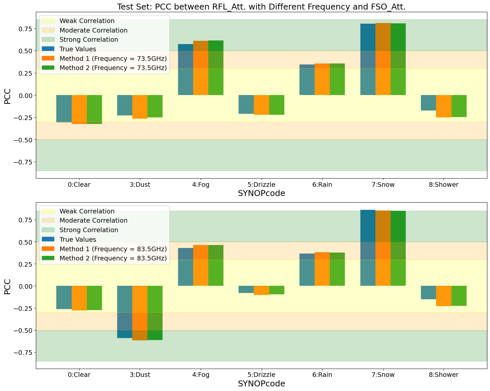
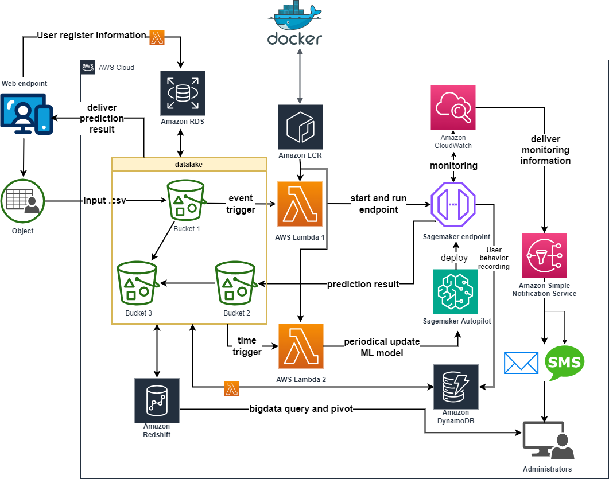

# Hybrid-Optical-Radio-Frequency-Communication-Channel-Model

## Project Overview  
This paper investigates the impact of weather on channel attenuation in hybrid Radio Frequency Line (RFL) and Free Space Optical (FSO) communication systems. It focuses on establishing robust predictive models for attenuation under varying weather conditions using ensemble algorithms, particularly Random Forest. The study explores the relationship between weather parameters and channel attenuation, identifying key predictors for different weather scenarios.

Through extensive data preprocessing, exploratory data analysis (EDA), and model development, specific, generic, and hybrid models are constructed for attenuation prediction. The research highlights the importance of feature pruning and hyperparameter tuning in optimizing model complexity and performance. Generic models outperform specific and hybrid models by reducing computational resource demands and enhancing interpretability, particularly excelling in foggy and dusty environments with smaller sample sizes. However, specific models perform better in clear and snowy conditions for the RF channel.

Hybrid models, which utilize the predicted attenuation of one channel as training data for predicting the attenuation of the other channel, effectively capture the correlation between RFL and FSO channels but do not improve prediction performance compared to generic models. Comparisons with actual values show that generic models provide effective and accurate predictions of channel attenuation in both RFL and FSO channels.

Overall, these findings offer valuable insights for mitigating weather-induced challenges in hybrid RFL/FSO communication systems, fostering the development of more resilient and efficient wireless connectivity solutions in diverse environmental conditions. The project also includes the automation of model deployment on AWS Cloud for scalable and efficient application.

################################  
**EDA.ipynb**  
exploration data analysis  
**RandomForest_tuning.ipynb**  
Build models including training, validation and testing.  
Store the model metric result by .csv file  
Store the model by the .pkl file 
**RandomForest_plot_final.ipynb**  
matplotlib figure showing experiment results
**random_forest_syncode.ipynb**  
build 7 different prediction models based on various weather conditions  
**projectB_for_PCC_NMI.ipynb & 1.ipynb**  
explore hybrid ML models  
**projectB_for_comparison_three_models.ipynb**  
compare the performance among three models  
################################  
RandomForest_plot_final.ipynb  
Based on the established model plotting various of figures  
################################  

## Target Variable Analysis  

## RFL and FSO Generic Model Training  

## Feature Importance and Pruning with 7 different weather conditions  

## Summuary of Important Features  
 

## The Comparison of Specific and Generic Model  

## The Prediction Result of Generic Model

## The real and predicted PCC between RFL_Att. and FSO_Att.

## The influence of different frequencies on the correlation between RFL and FSO channels.

## Deploy these models in AWS Cloud  
